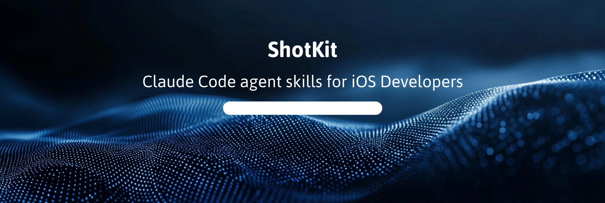
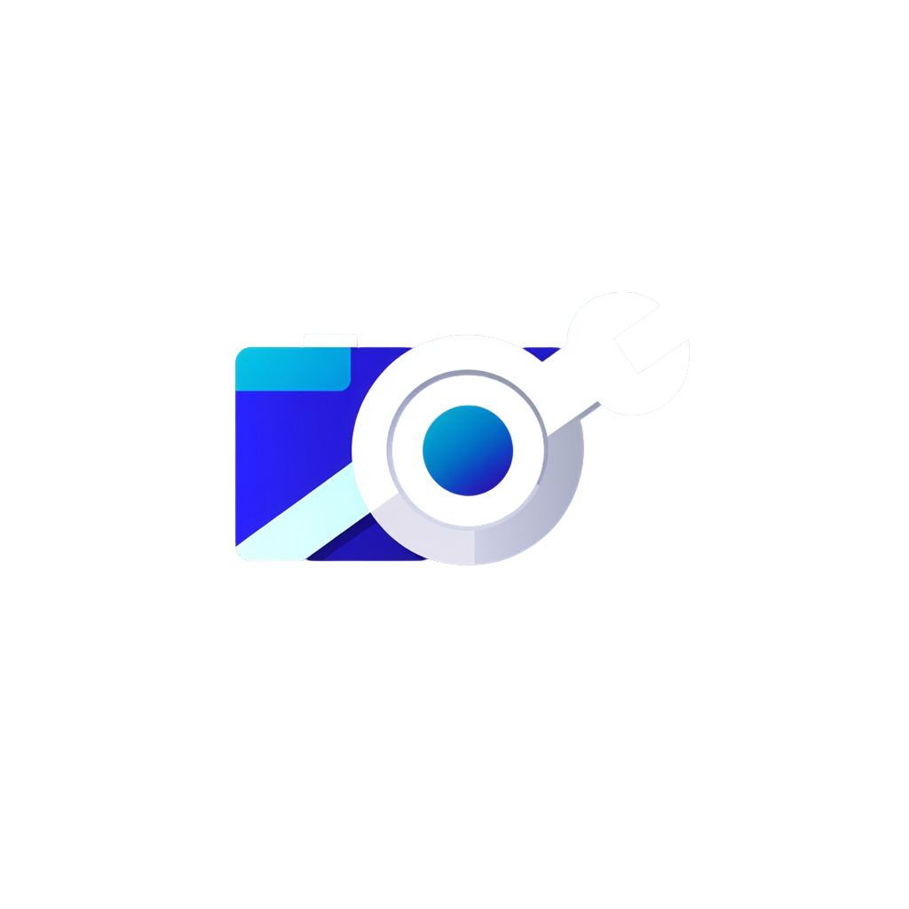

# Shotkit


Open source Claude Code agent skills for iOS developers and content creators on Mac.

Built by [Nicolò Curioni](https://withnico.com) 🔸 — [@nicolocurioni96](https://github.com/nicolocurioni96)

---

## Install

### Homebrew (recommended)

```bash
brew tap nicolocurioni96/tools
brew install shotkit
```

Then use the `shotkit` CLI directly:
```bash
shotkit init                                              # connect to App Store Connect
shotkit capture --bundle-id com.app.id --deeplinks "..."  # auto-capture from Simulator
shotkit generate --app-name "MyApp" --template trending   # generate with trending styles
shotkit upload --dir ./screenshots-output                  # upload to App Store Connect
```

### As an Agent Skill

Install all skills at once:
```bash
npx ai-agent-skills install nicolocurioni96/withnico-skills
```

Install a single skill:
```bash
npx ai-agent-skills install nicolocurioni96/withnico-skills --skill shotkit
```

Or register as a Claude Code plugin:
```
/plugin install withnico-skills@nicolocurioni96
```

Works with **Claude Code**, **Cursor**, **Codex**, **Gemini CLI**, **OpenCode**, and any agent following the [Agent Skills open standard](https://agentskills.io).

---

## Skills

| Skill | What it does | Platform | Status |
|-------|-------------|----------|--------|
| [shotkit](./skills/shotkit/) | End-to-end App Store screenshot pipeline: auto-capture → trending styles → App Store Connect upload | macOS | ✅ Ready |

More skills coming — see [Roadmap](#roadmap).

---

## shotkit

The full App Store screenshot workflow in one Claude Code skill.

**Trigger phrases:**
- "create my App Store screenshots"
- "generate screenshots for my app"
- "design screenshot templates"
- "capture simulator screenshots"
- "build my App Store creatives"

**What it does:**

1. **Auto-Capture** — boots Simulator devices, launches your app, navigates via deep links, sets a clean status bar, and captures screenshots — fully automated, zero manual interaction
2. **Copy** — generates locale-aware headlines (max 30 chars) + sublines (max 60 chars) per screenshot
3. **Composite** — renders styled images using Pillow with 6 template styles including trending auto-styles
4. **Organize & Validate** — outputs an ASC-ready folder structure, validates dimensions
5. **App Store Connect** — native integration to upload, update, and download screenshots directly

**6 Template Styles:**

| Template | Best For | Style |
|----------|---------|-------|
| `trending` | Any app | Auto-styled with curated palettes from top-charting apps |
| `minimal` | Productivity, utilities, finance | White bg, shadow device, clean text below |
| `bold` | Games, lifestyle, fitness | Full-bleed gradient, large text at top |
| `dark` | Pro tools, music, photography | Black bg, colored glow, premium feel |
| `editorial` | Creative, travel, shopping | Split layout, magazine composition |
| `flat` | Photo/video, maps, AR | Full-bleed UI, semi-transparent text bar |

**Trending palettes:** aurora, sunset-pop, midnight, ocean, coral, forest, neon, slate, peach, electric — or auto-extract from your app icon.

**Device support (2025/2026):**
- iPhone 6.9" — 1320 × 2868 px ✅ mandatory
- iPhone 6.7" — 1290 × 2796 px
- iPhone 6.5" — 1242 × 2688 px
- iPad 13" — 2064 × 2752 px ✅ mandatory (if iPad)
- iPad 12.9" — 2048 × 2732 px

**Locale support:**
en-US, it, de, ja, fr, es, pt-BR, ko — tone-adapted per market.

**App Store Connect integration:**
```bash
shotkit init                           # connect with your API key
shotkit apps                           # list your apps
shotkit download --output ./backup     # download existing screenshots
shotkit upload --dir ./screenshots-output   # upload new screenshots
shotkit update --dir ./screenshots-output   # replace existing screenshots
```

**Requirements:**
- macOS only
- Xcode installed (for Simulator capture)
- Python 3.8+ (auto-detected)
- Pillow, PyJWT, cryptography (auto-installed)
- App Store Connect API key (for upload/download — [create one here](https://appstoreconnect.apple.com/access/integrations/api))

**Quick start:**
```bash
# 1. Connect to App Store Connect
shotkit init

# 2. Full pipeline in one command
shotkit screenshots \
  --bundle-id com.yourapp.bundleid \
  --app-name "YourApp" \
  --template trending \
  --icon ./icon.png \
  --deeplinks "myapp://home,myapp://detail,myapp://settings" \
  --screens "home,detail,settings"

# 3. Upload to App Store Connect
shotkit upload --dir ./screenshots-output
```

**Or step by step:**
```bash
shotkit capture --bundle-id com.app.id --deeplinks "myapp://home,myapp://detail"
shotkit generate --app-name "MyApp" --captures ./raw --template trending --palette aurora
shotkit validate --dir ./screenshots-output
shotkit upload --dir ./screenshots-output
```

**Key features:**
- Fully automated Simulator capture — zero manual interaction
- 10 curated trending palettes + auto-extract from app icon
- Native App Store Connect integration — upload, download, update
- Multi-device, multi-locale support
- ASC-ready folder structure with validation

---

## Roadmap

| Skill | What it will do |
|-------|----------------|
| `xcode-release-notes` | git log → App Store What's New copy in multiple languages |
| `ios-localization` | Localize App Store metadata for 28+ territories intelligently |
| `transcript-recycler` | YouTube URL → full content repurposing pack |
| `youtube-package` | One brief → complete bilingual YouTube video content package |
| `apple-notes-agent` | Create, search, and manage Apple Notes from Claude Code |
| `swift-review` | SwiftUI and iOS-specific code review: architecture, App Store compliance |

---

## Contributing

PRs welcome. Each skill lives in `skills/<skill-name>/` with:
```
skills/my-skill/
├── SKILL.md
├── scripts/
└── references/
```

Follow the [Agent Skills open standard](https://agentskills.io) for `SKILL.md` format.

---

## License

MIT — see [LICENSE](./LICENSE)

---

## Author

Nicolò Curioni — [withnico.com](https://withnico.com) · [@nicolocurioni96](https://github.com/nicolocurioni96)

iOS Engineer · AI Evangelist · Indie Developer · Content Creator

Discord: https://discord.gg/JXgrVwqa8b
